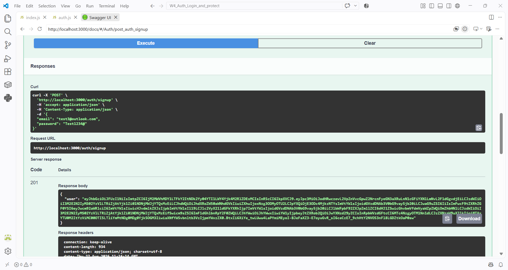
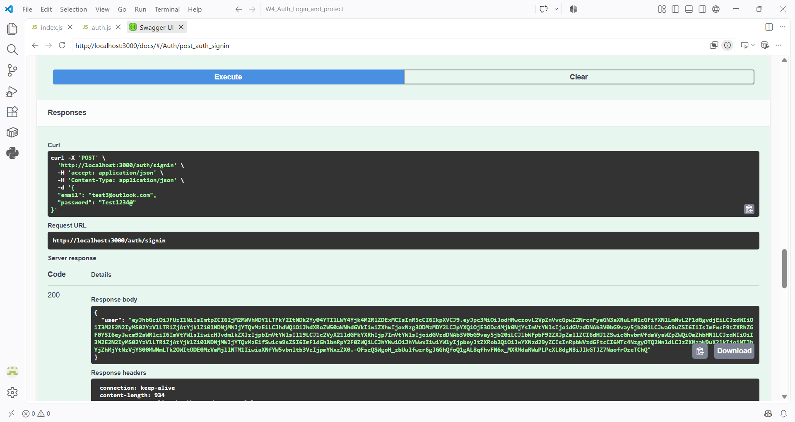
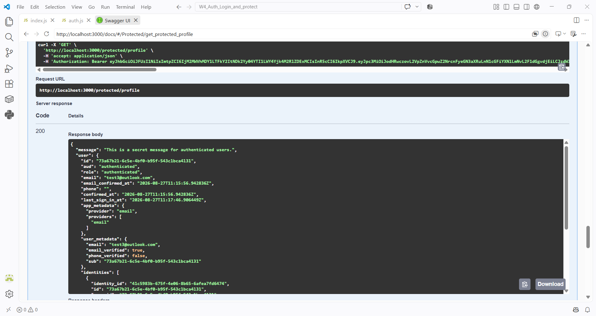
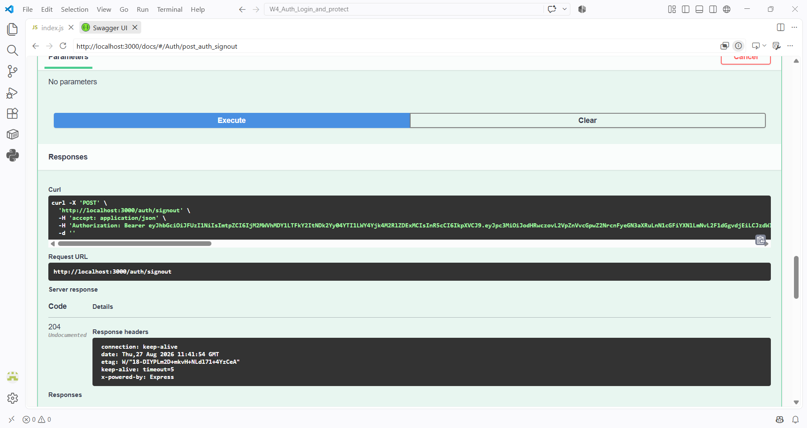

# Stage W4: Supabase Authentication

This stage adds real authentication to the Task API using [Supabase Auth](https://supabase.com/docs/guides/auth). It builds on the previous stages of the assignment series (in-memory → SQLite → PostgreSQL) by adding signup, signin, signout, and JWT-protected routes on top of the existing Express API.

Two demo routes (`/public/info` and `/protected/profile`) exist purely to prove the auth middleware works correctly before it's applied to the real task routes.

## What this project does

- Lets users sign up and sign in with email/password via Supabase
- Returns a JWT `access_token` on signin that can be used to call protected routes
- Verifies that token on every protected request using `supabase.auth.getUser(token)` in a reusable `requireAuth` middleware
- Lets a signed-in user sign out
- Documents every endpoint with a Swagger UI you can test directly in the browser

## Setup

### 1. Install dependencies

```bash
npm install
```

### 2. Configure environment variables

Create a `.env` file in the project root:

```env
SUPABASE_URL=https://your-project.supabase.co
SUPABASE_KEY=your-supabase-anon-key
PORT=3000
```

| Variable | Description |
|---|---|
| `SUPABASE_URL` | Your Supabase project URL, from Project Settings → API |
| `SUPABASE_KEY` | Your Supabase project's anon/public key, from Project Settings → API |
| `PORT` | Port the server listens on (optional, defaults to `3000`) |

> Environment variables are loaded with `dotenvx` before any other module is required, so they're guaranteed to be available to the Supabase client at startup.

### 3. Run it

```bash
npm start
```

The API will be available at `http://localhost:3000`, and the interactive Swagger docs at `http://localhost:3000/docs`.

## API Reference

| Method | Endpoint | Auth required? | Description |
|---|---|:---:|---|
| `POST` | `/auth/signup` | No | Create a new account with email + password |
| `POST` | `/auth/signin` | No | Sign in and receive a JWT `access_token` |
| `POST` | `/auth/signout` | Yes | Sign out the current session |
| `GET` | `/public/info` | No | Demo route confirming public access works |
| `GET` | `/protected/profile` | Yes | Demo route confirming JWT auth middleware works |

For protected routes, pass the token from `/auth/signin` as a header:

```
Authorization: Bearer <access_token>
```

Full request/response schemas, including error responses, are documented in Swagger UI at `/docs`.

## Swagger UI in action

**Sign up** — creates a new Supabase user and returns an access token:



**Sign in** — authenticates an existing user and returns an access token:



**Protected profile** — the request includes the Bearer token in the `Authorization` header, and the middleware verifies it before returning the authenticated user's data:



**Sign out** — ends the session for the authenticated user:



## Tech stack

- Node.js + Express
- Supabase (`@supabase/supabase-js`) for authentication
- `swagger-ui-express` + OpenAPI 3.0 for API documentation
- `dotenvx` for environment variable management
